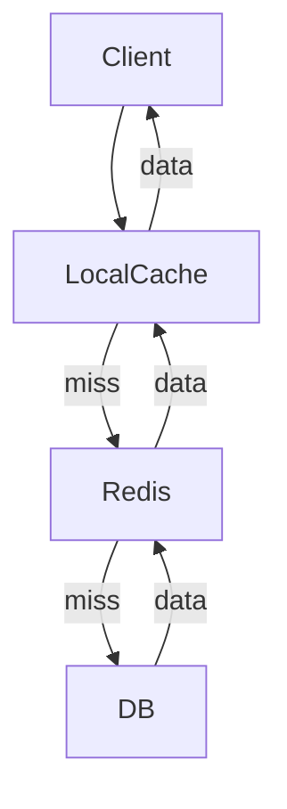

# 分布式缓存

分布式缓存用于提升读性能、削峰填谷与降低后端压力。关键关注一致性、容量、热点与容灾。

## 缓存架构

- 本地缓存：进程内（Guava Caches、Caffeine），访问快，容量有限
- 远程缓存：Redis/Memcached，集中管理，容量大
- 多级缓存：本地 + 远程，命中优先本地
- 读写路径：Cache-Aside、Read/Write-Through、Write-Behind



## 缓存策略

- Key设计：层级前缀（module:entity:id），避免过长
- 过期策略：TTL + 随机抖动，错峰过期
- 热点保护：互斥锁/单飞（singleflight）
- 一致性策略：失效策略、双删、订阅通知（Redis Keyspace/Stream）

```yaml
# Redis淘汰策略（redis.conf）
maxmemory 1gb
maxmemory-policy allkeys-lru
```

## 缓存一致性

- 最终一致：写库后删缓存（或更新缓存），允许短暂不一致
- 强一致：写入链路串行化（先删后写 + 同步更新），成本高
- 订阅通知：通过发布订阅/流通知各副本失效

双删示例：

```java
public void updateThenEvict(User user) {
    // 先更新DB
    userRepository.save(user);
    // 删缓存
    redisTemplate.delete("user:" + user.getId());
    // 延迟双删，避免并发读写穿透旧值
    java.util.concurrent.CompletableFuture.runAsync(() -> {
        try { Thread.sleep(300); } catch (InterruptedException ignored) {}
        redisTemplate.delete("user:" + user.getId());
    });
}
```

## 缓存穿透、击穿、雪崩

- 穿透：请求不存在数据直达DB
  - 方案：布隆过滤器，缓存空值并短TTL
- 击穿：热点Key失效瞬间大量并发打到DB
  - 方案：互斥锁/单飞、逻辑永不过期（后台刷新）
- 雪崩：大量Key同时过期
  - 方案：TTL随机抖动、分片错峰、预热

逻辑永不过期：

```java
class CacheEntry`<T>` { T data; long expireAt; }
public CacheEntry`<User>` getUser(long id) {
    CacheEntry`<User>` entry = localCache.get(id);
    if (entry != null && System.currentTimeMillis() < entry.expireAt) {
        return entry; // 命中新鲜数据
    }
    // 过期则触发后台刷新，但继续返回旧值（若存在）
    backgroundRefresh(id);
    return entry; // 旧值容忍
}
```

## 监控与告警

- 命中率、平均延迟、P99、失败率
- 热点Key排行、带宽、连接数
- 慢查询/阻塞操作（大key、keys/flushall）

## 面试题

1. Cache-Aside与Write-Through/Behind的差异与场景
2. 如何解决缓存穿透/击穿/雪崩
3. 双删策略为什么要延迟，延迟多长合适
4. 多级缓存一致性如何保证
5. 如何识别与治理热点Key
